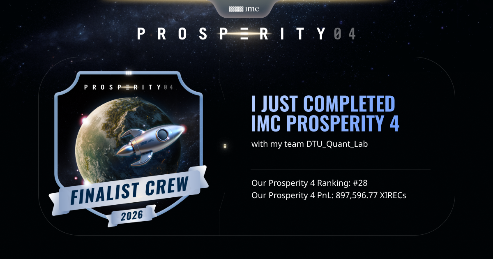
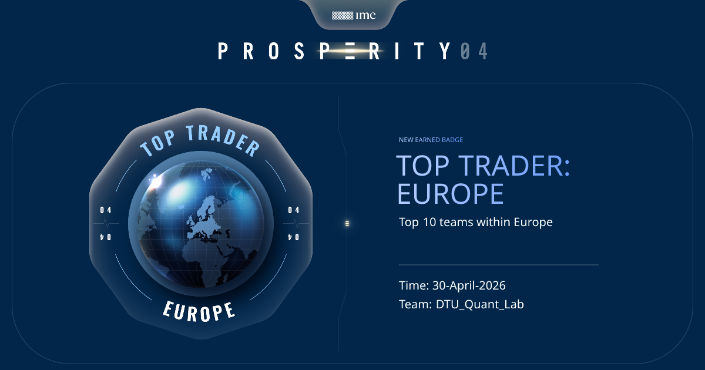
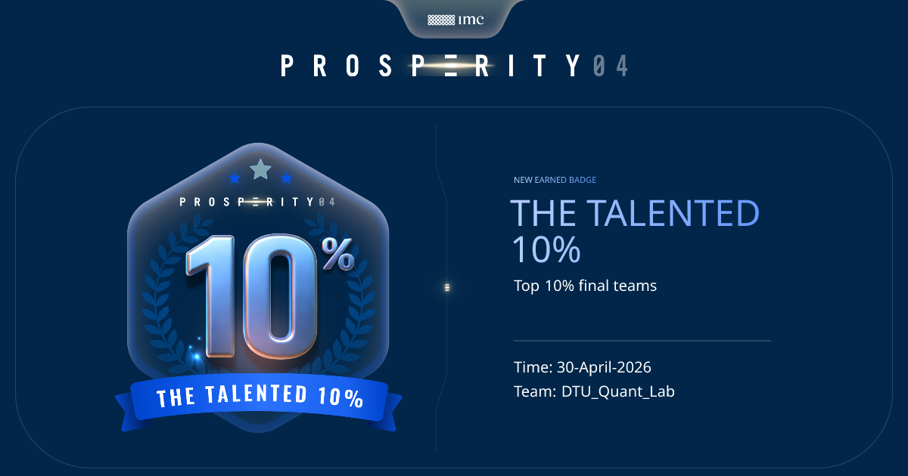
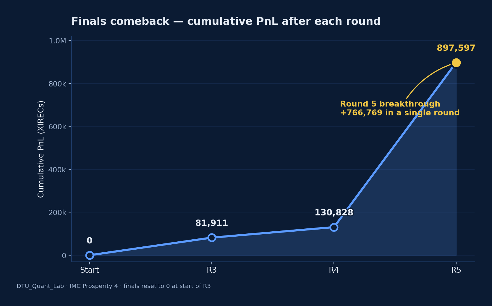
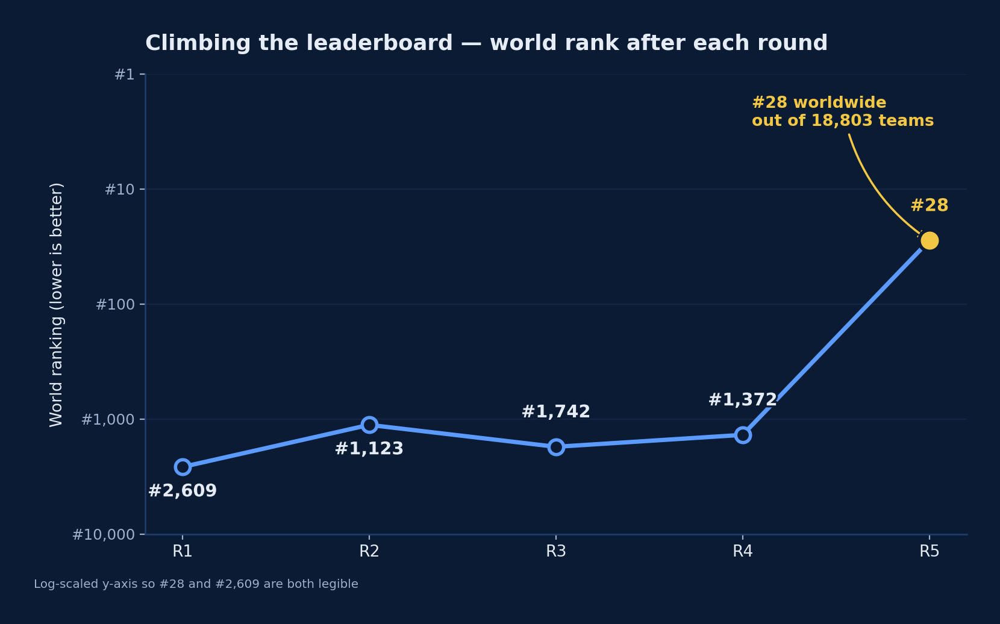
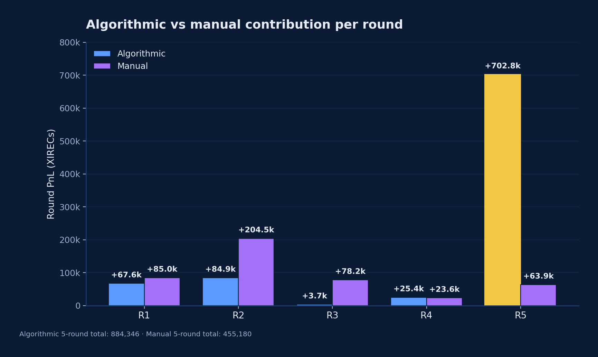
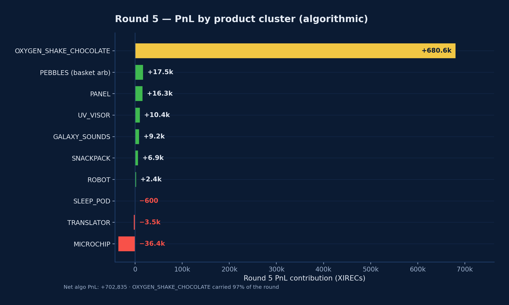
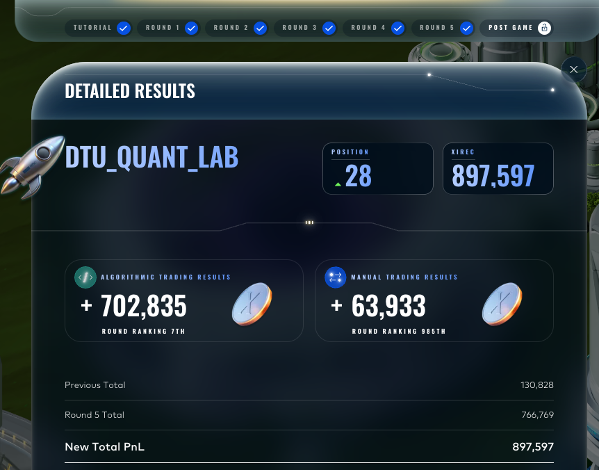

# DTU Quant Lab — IMC Prosperity 4

> **Final placement: 28th worldwide out of 18,803 teams · 31st algorithmic · 10th Europe · 1st Denmark · Top Trader Europe · Top 10% Finalist.**

<p align="center">
  
</p>

This repository archives the algorithmic and manual trading strategies that team **DTU_Quant_Lab** shipped during IMC Prosperity 4. It contains the five trader files we submitted to the live competition (verbatim, one per round), the Prosperity-distributed market data we used for backtesting, a reproducible inspection dashboard, and a per-round account of which academic papers actually made it into the code — and which were rejected by backtests.

It is also a story about a comeback. We crashed from #1,123 after Round 2 to #1,742 after Round 3, recovered slowly to #1,372 in Round 4, and finally placed 7th in the world in the Round 5 algorithmic challenge — a jump of **+702,835 XIRECs in a single round** that vaulted us to the #28 finish.

<p align="center">
  
  &nbsp;&nbsp;
  
</p>

---

## The campaign at a glance

| Round | Algorithmic PnL | Algo rank | Manual PnL | Manual rank | Round total | Cumulative | Global position |
|-------|----------------:|----------:|-----------:|------------:|------------:|-----------:|----------------:|
| 1     | +67,585         | 3,646     | +85,000    | **25**      | 152,585     | 152,585    | 2,609           |
| 2     | +84,889         | 1,999     | +204,456   | **58**      | 289,344     | 441,929    | 1,123           |
| 3     | +3,686          | 2,232     | +78,225    | **69**      | 81,911 \*   | 81,911     | 1,742           |
| 4     | +25,351         | 1,149     | +23,566    | 699         | 48,917      | 130,828    | 1,372           |
| 5     | **+702,835**    | **7**     | +63,933    | 985         | **766,769** | **897,597**| **28**          |

\* Prosperity zeroes the cumulative PnL after the qualifier (R1 + R2). The finals run from Round 3 to Round 5.

**Combined totals across the five rounds:** **884,346** algorithmic and **455,180** manual XIRECs.

<p align="center">
  
  
</p>

<p align="center">
  
  
</p>

Augusto Villoldo led the manual trading desk and finished **25th, 58th and 69th** in the first three rounds — a top-100 hat-trick that kept us alive through the algorithmic underperformance of Round 3.

The final Round 5 result page from the Prosperity portal:

<p align="center">
  
</p>

---

## What's in this repository

- **`round_1/` … `round_5/`** — One folder per round, each containing:
  - `algorithmic/trader.py` — the exact Python file submitted to the simulator
  - `algorithmic/data/` — the Prosperity-distributed historical CSVs we backtested on
  - `algorithmic/README.md` — the strategy, the papers it cites, and how to reproduce the backtest
  - `manual/README.md` — the manual challenge, our decision, and the result
  - `README.md` — a one-page round overview
- **`tools/dashboard.py`** — a single-file Plotly Dash viewer for `.log` files emitted by the backtester or downloaded from the Prosperity website
- **`docs/results/`** — portal screenshots of every round and every manual challenge
- **`docs/plots/`** — the PnL and rank charts used in this README
- **`docs/journey.md`** — the long-form story of the campaign
- **`docs/literature_review.md`** — every paper we read, broken down by what shipped and what we rejected (with the backtest number that killed each rejected idea)

---

## Methodology

Every strategy in this repository was developed with the same loop:

1. **Read papers and competitor write-ups.** Mostly English microstructure literature (Avellaneda–Stoikov, Stoikov micro-price, Huang–Lehalle–Rosenbaum, Cartea–Jaimungal, Black–Scholes), supplemented by translated French, Dutch, Japanese, Russian and Chinese sources where the IMC challenge structure suggested local-market parallels.
2. **Code a candidate strategy** against the Prosperity-distributed historical data using `prosperity4btest` 5.0.0.
3. **Backtest with a worst-day-mode rule.** A strategy was only allowed to ship if its worst single backtest day was positive — never average performance alone.
4. **Cross-check on day-N live data** once Prosperity released it after each round.
5. **Ship only the changes that survived steps 3 and 4.** Most of the literature was rejected at step 3.

The "rejected" inventory in [`docs/literature_review.md`](docs/literature_review.md) is the single most useful artifact in this repository for anyone preparing for Prosperity 5. It catalogues every paper we surveyed and, where relevant, the backtest number that killed it (for example: Avellaneda–Stoikov position-skew on the pegged Round 1 product produced −16,593 PnL; Ho–Stoll dealer model produced −26,497; Bouchaud–Potters square-root impact correlation came out at −0.06; the Russian optimal-stopping school produced +128 aggregate but −41 on the binding worst day).

---

## Team

| Name              | Role                                                                                          | GitHub                                                          | LinkedIn |
|-------------------|-----------------------------------------------------------------------------------------------|-----------------------------------------------------------------|----------|
| Jakub Piotrowski  | Strategy lead, infrastructure, backtesting framework, Round 3–5 algorithmic development       | [@DataAthleteChamp](https://github.com/DataAthleteChamp)         | [jakub-piotrowski-894117272](https://www.linkedin.com/in/jakub-piotrowski-894117272/) |
| Krish Waghresha   | Algorithmic strategy research — paper reading, candidate implementations across all rounds    | [@Krish-Waghresha](https://github.com/Krish-Waghresha)           | [krish-waghresha](https://www.linkedin.com/in/krish-waghresha/) |
| Pedro Diniz       | Algorithmic strategy research — paper reading, candidate implementations across all rounds    | [@TheOfficialPetereo](https://github.com/TheOfficialPetereo)     | [petereo](https://www.linkedin.com/in/petereo/) |
| Mark van Damme    | Manual trading research, algorithmic strategy review, independent backtest verification       | [@Mr-Seoul](https://github.com/Mr-Seoul)                         | [mark-van-damme-7b1b0132a](https://www.linkedin.com/in/mark-van-damme-7b1b0132a/) |
| Augusto Villoldo  | Manual trading lead — 25th (R1), 58th (R2), 69th (R3)                                         | [@augustoivilloldo](https://github.com/augustoivilloldo)         | [augusto-villoldo](https://www.linkedin.com/in/augusto-villoldo/) |

---

## Reproducing the results

```bash
git clone https://github.com/DataAthleteChamp/dtu-quant-lab-imc-prosperity-4
cd dtu-quant-lab-imc-prosperity-4
python -m venv .venv && source .venv/bin/activate
pip install -r requirements.txt
```

Then to replay any round:

```bash
# Round 5 against day 4
prosperity4btest cli round_5/algorithmic/trader.py 4

# Round 3 against days 0, 1, 2 in one go
prosperity4btest cli round_3/algorithmic/trader.py 0 1 2
```

To inspect a `.log` file in the browser:

```bash
python tools/dashboard.py path/to/file.log
```

The dashboard accepts both `.log` files emitted by the backtester and the JSON `.log` exports from the Prosperity website.

---

## Community tools we built and used

- **[IMC_Prosperity_discord_scraper](https://github.com/DataAthleteChamp/IMC_Prosperity_discord_scraper)** — our own scraper for the Prosperity Discord server. We used it to harvest signal from a high-noise channel: organiser clarifications, anonymised hints about what was and was not working for other teams, and historical leaks from prior years.
- **[jmerle/imc-prosperity-3-backtester](https://github.com/jmerle/imc-prosperity-3-backtester)** (and its successor `prosperity4btest`) — the open-source backtester that drove every iteration in this repository. Indispensable.
- **[jmerle/imc-prosperity-2](https://github.com/jmerle/imc-prosperity-2)** — the 9th-place voucher template from Prosperity 2 Round 4 is cited directly in our Round 3 trader.
- **[TimoDiehm/imc-prosperity-3](https://github.com/TimoDiehm/imc-prosperity-3)** — Frankfurt Hedgehogs' 2nd-place Prosperity 3 repo. Their RainforestResin StaticTrader pattern is the foundation of our Round 1 OSMIUM logic.

---

## Acknowledgements

To IMC Trading for organising the challenge, and to **Hrvoje Abramović**, **Jasper van Merle** (whose work is cited in our Round 3 trader), and **Serena Riccomagno** for the Prosperity 4 webinar and the Q&A sessions.

---

## Licence and citation

This repository is released under the [MIT licence](LICENSE). If you reference this work, the recommended citation is in [`CITATION.cff`](CITATION.cff).

> First attempt. Many mistakes. A long climb back. The next one starts soon.
