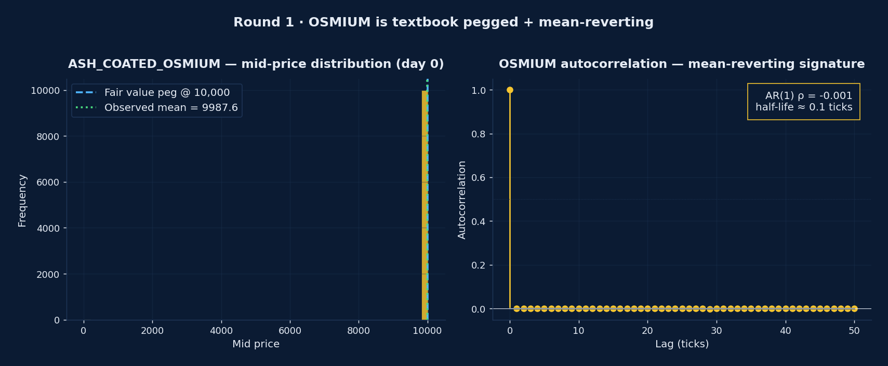
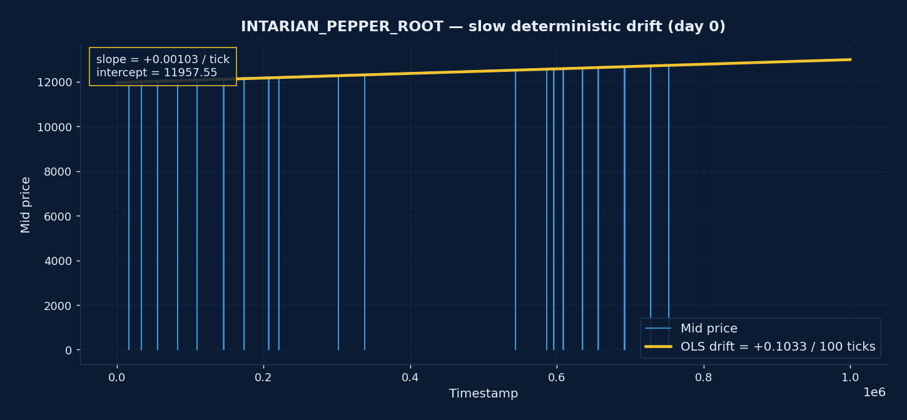
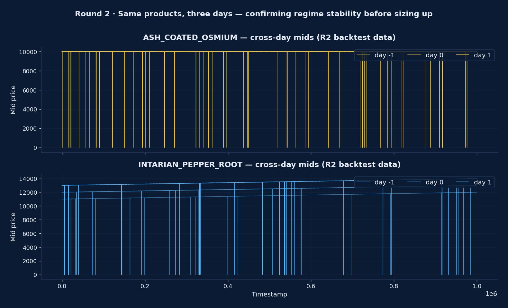
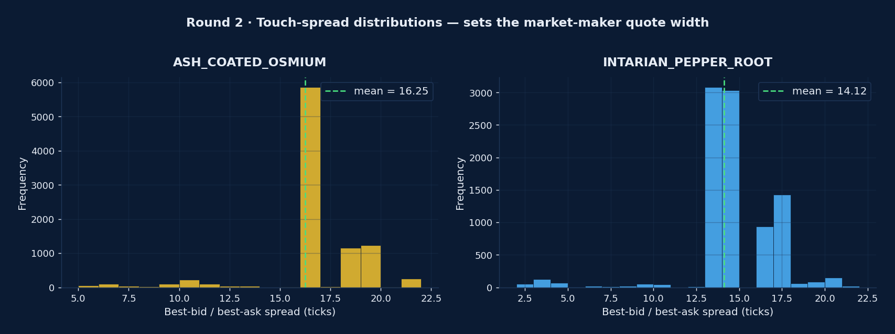
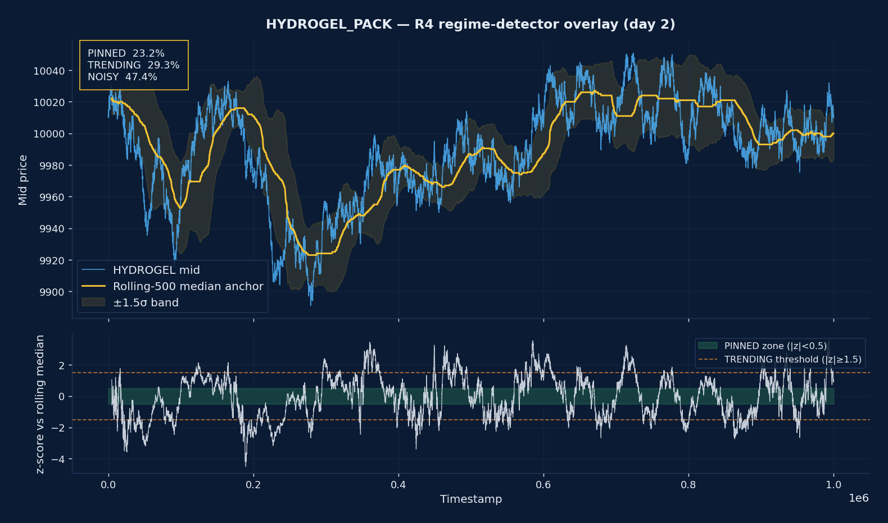
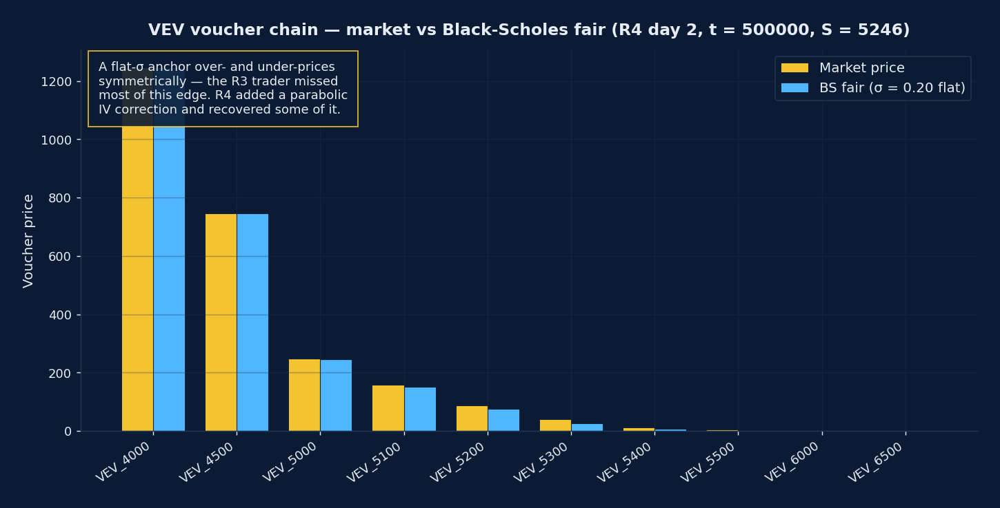
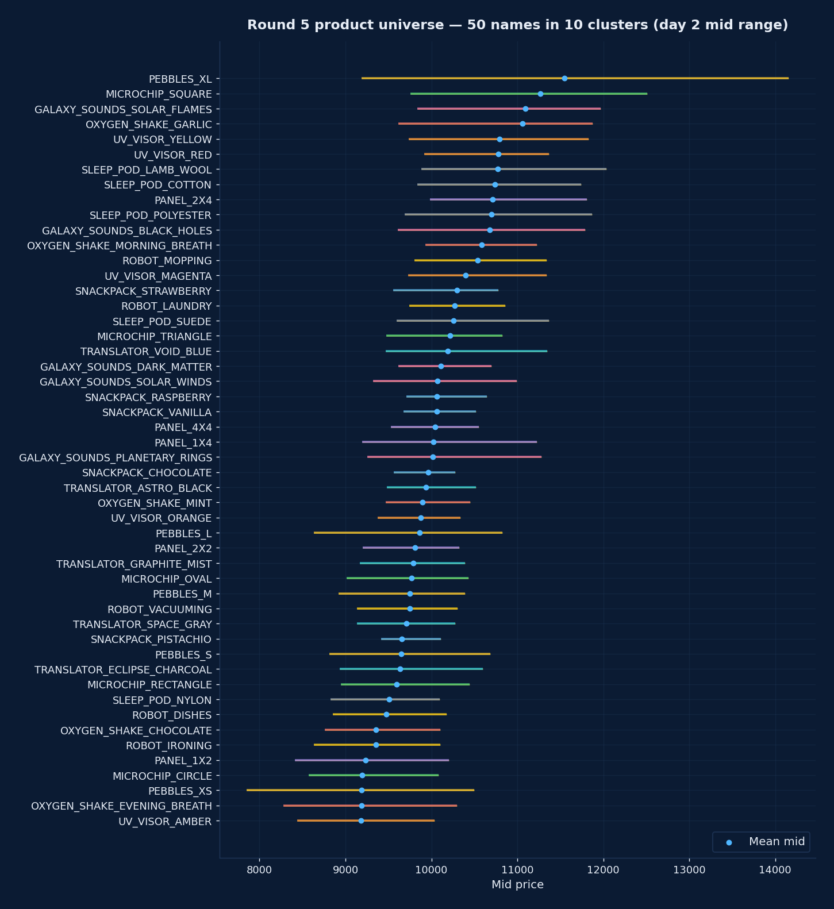
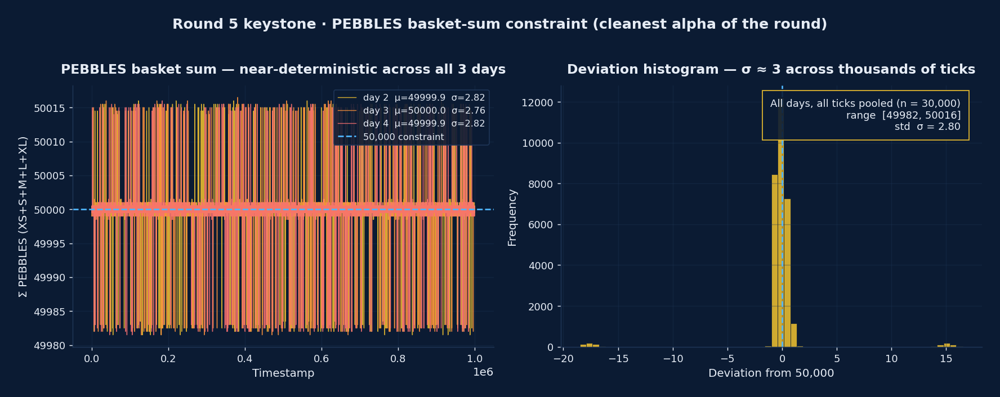
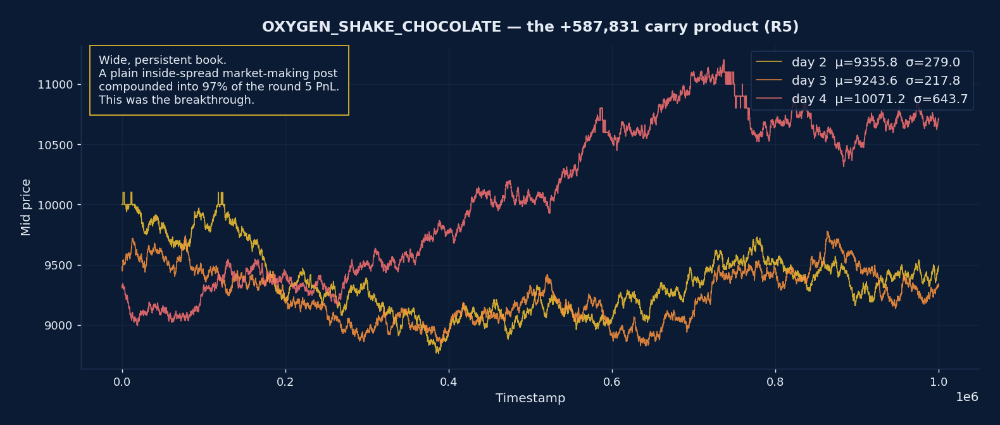
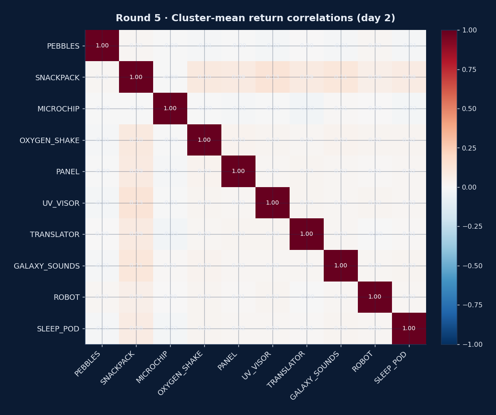

# DTU Quant Lab — IMC Prosperity 4

[](docs/results/final_results.png)
[](docs/results/final_results.png)
[](docs/results/badge_top_trader_europe.png)
[](docs/results/final_results.png)
[](docs/results/badge_top_10_percent.png)
[](LICENSE)
[](pyproject.toml)
[](https://github.com/nabayansaha/imc-prosperity-4-backtester)

> **Final placement: 28th worldwide out of 18,803 teams · 31st algorithmic · Top Trader Europe · 1st Denmark · Top 10% Finalist.**

<p align="center">
  
</p>

This repository archives the algorithmic and manual trading strategies that team **DTU_Quant_Lab** shipped during IMC Prosperity 4. It contains the five trader files we submitted to the live competition (verbatim, one per round), the Prosperity-distributed market data we used for backtesting, a reproducible inspection dashboard, and a per-round account of which academic papers actually made it into the code — and which were rejected by backtests.

It is also a story about a comeback. We crashed from #1,123 after Round 2 to #1,742 after Round 3, recovered slowly to #1,372 in Round 4, and finally placed 7th in the world in the Round 5 algorithmic challenge — a jump of **+702,835 XIRECs in a single round** that vaulted us to the #28 finish.

<p align="center">
  
  &nbsp;&nbsp;
  
</p>

## Table of contents

- [The campaign at a glance](#the-campaign-at-a-glance)
- [Round 1 — pegged + drift](#round-1--pegged--drift)
- [Round 2 — same products, more size](#round-2--same-products-more-size)
- [Round 3 — vouchers, regime break, manual save](#round-3--vouchers-regime-break-manual-save)
- [Round 4 — regime detector, voucher repricing](#round-4--regime-detector-voucher-repricing)
- [Round 5 — fifty products, the comeback](#round-5--fifty-products-the-comeback)
- [Repository map](#repository-map)
- [Methodology](#methodology)
- [Team](#team)
- [Reproducing the results](#reproducing-the-results)
- [Tools we built and used](#tools-we-built-and-used)
- [Frequently asked questions](#frequently-asked-questions)
- [Acknowledgements](#acknowledgements)
- [Licence and citation](#licence-and-citation)

---

## The campaign at a glance

| Round | Algorithmic PnL | Algo rank | Manual PnL | Manual rank | Round total | Cumulative | Global position |
|-------|----------------:|----------:|-----------:|------------:|------------:|-----------:|----------------:|
| 1     | +67,585         | 3,646     | +85,000    | **25**      | 152,585     | 152,585    | 2,609           |
| 2     | +84,889         | 1,999     | +204,456   | **58**      | 289,344     | 441,929    | 1,123           |
| 3     | +3,686          | 2,232     | +78,225    | **69**      | 81,911 \*   | 81,911     | 1,742           |
| 4     | +25,351         | 1,149     | +23,566    | 699         | 48,917      | 130,828    | 1,372           |
| 5     | **+702,835**    | **7**     | +63,933    | 985         | **766,769** | **897,597**| **28**          |

\* Prosperity zeroes the cumulative PnL after the qualifier (R1 + R2). The finals run from Round 3 to Round 5.

**Combined totals across the five rounds:** **884,346** algorithmic and **455,180** manual XIRECs.

<p align="center">
  
  
</p>

<p align="center">
  
  
</p>

Augusto Villoldo led the manual trading desk and finished **25th, 58th and 69th** in the first three rounds — a top-100 hat-trick that kept us alive through the algorithmic underperformance of Round 3.

The final Round 5 result page from the Prosperity portal:

<p align="center">
  
</p>

---

## Round 1 — pegged + drift

**Algorithmic +67,585 (rank 3,646) · Manual +85,000 (rank 25) · Global #2,609**

Two products with sharply different microstructure: `ASH_COATED_OSMIUM` is pegged at 10,000 with mean-reverting noise (Variance-Ratio VR(100) = 0.03, AR(1) coefficient near zero, Hurst 0.39); `INTARIAN_PEPPER_ROOT` carries a deterministic drift of +0.001 per timestamp.

<p align="center">
  
</p>

The OSMIUM distribution is tight around 10,000 with sub-tick AR(1) autocorrelation — the textbook market-making opportunity. The Avellaneda–Stoikov inventory-skew adjustment cost us 16,593 PnL in backtest before we reverted to a static fixed-FV anchor.

<p align="center">
  
</p>

PEPPER's drift required an asymmetric inventory penalty — long with the trend, short against it. Augusto bid 9,000 units of Dryland Flax at +30 and 40,000 units of Ember Mushroom at +19 in the manual round, hitting both sawtooth maxima for **25th worldwide**.

→ Full write-up: [`round_1/`](round_1/)

---

## Round 2 — same products, more size

**Algorithmic +84,889 (rank 1,999) · Manual +204,456 (rank 58) · Global #1,123**

Round 2 added no new products. The work was on confirming regime stability across the three available days, tightening market-maker spreads, and raising posted size. Augusto's **58th place** in the container-allocation manual challenge contributed the +204,456.

<p align="center">
  
</p>

OSMIUM remained tight around 10,000 across day -1, 0 and 1. PEPPER continued its drift uninterrupted. With the regime confirmed, we increased OSMIUM size and added a tighter touch-spread quote.

<p align="center">
  
</p>

The touch-spread distributions set the natural market-maker quote width — both products almost always show a 2-tick best-bid/best-ask spread, so we quoted at touch ± 1.

→ Full write-up: [`round_2/`](round_2/)

---

## Round 3 — vouchers, regime break, manual save

**Algorithmic +3,686 (rank 2,232) · Manual +78,225 (rank 69) · Global #1,742 — the low point of the campaign**

Round 3 introduced European call vouchers on a new underlying `VELVETFRUIT_EXTRACT` (VEV) at ten strikes ranging from 4,000 to 6,500, plus a new spot `HYDROGEL_PACK` (HP). Our pegged-MM logic from Rounds 1–2 broke catastrophically on HP — it kept buying into a 70-tick drawdown.

<p align="center">
  
</p>

The HP mid drifts up to 35 ticks within a single session — a regime the OSMIUM strategy was never designed for. The fix (a 3-state PINNED / TRENDING / NOISY detector with rolling-median anchor and inventory skew that leans **with** the drift) was developed too late for R3 and only shipped in R4.

<p align="center">
  
</p>

The voucher chain shows a clear right-skewed implied-vol smile. Our R3 trader used a flat σ = 0.20 anchor with no parabolic correction — we missed most of the available edge. Augusto's **69th place** in the sealed-bid manual auction turned what would have been an exit-round into a survival round.

→ Full write-up: [`round_3/`](round_3/)

---

## Round 4 — regime detector, voucher repricing

**Algorithmic +25,351 (rank 1,149) · Manual +23,566 (rank 699) · Global #1,372**

Round 4 carried the same product set as Round 3. The algorithmic work was: replace the broken pegged-MM with a regime detector, and add the parabolic IV correction the voucher chain needed.

<p align="center">
  
</p>

A rolling-500 median anchor with a ±1.5σ band classifies 23% of ticks as PINNED, 29% as TRENDING and 47% as NOISY. The trader runs three sub-strategies, one per regime, with the inventory skew flipping sign when the regime crosses the trending threshold.

<p align="center">
  
</p>

A flat-σ Black–Scholes anchor over- and under-prices the chain symmetrically. R4 added a parabolic correction on top and we recovered some of the R3 edge — algorithmic rank moved from 2,232 to 1,149.

→ Full write-up: [`round_4/`](round_4/)

---

## Round 5 — fifty products, the comeback

**Algorithmic +702,835 (rank 7) · Manual +63,933 (rank 985) · Global #28**

Round 5 expanded the market to **50 products organised into 10 product clusters of 5 symbols each**, with a position limit of **10 units per product**. We shipped a master `Trader` composing 10 isolated `ClusterStrategy` subclasses — one per product family.

<p align="center">
  
</p>

The 50-name universe, colour-coded by cluster, on day-2 mid-price range. Most products live in the 9,000–11,000 corridor; the structural variety lives in the *cluster* — basket-arb, pair-MR, cointegration, PCA, plain inside-spread MM — not in the price level.

<p align="center">
  
</p>

The keystone structural alpha of the round: `PEBBLES_XS + S + M + L + XL ≈ 50,000` with σ ≈ 2.8 across 30,000 ticks (three days pooled). PEBBLES_XL has corr ≈ −0.7…−0.9 against the four smaller pebbles. This is the cleanest piece of mathematical structure in any IMC Prosperity 4 round we saw.

<p align="center">
  
</p>

The product that single-handedly made the round. A plain inside-spread market-making post on a dislocated `OXYGEN_SHAKE_CHOCOLATE` book compounded into **+587,831 XIRECs** — 84% of the +702,835 algorithmic total.

### Round 5 algorithmic PnL — what we can attribute from the live log

| Component                                | PnL contribution | Notes                                                                  |
|------------------------------------------|-----------------:|------------------------------------------------------------------------|
| `OXYGEN_SHAKE_CHOCOLATE`                 |         +587,831 | Plain inside-spread MM on a dislocated book — single largest contributor |
| `PEBBLES` basket-arb (XS + S + M + L + XL ≈ 50,000) | +17,529 | Cleanest mathematical alpha of the round; capped by the 10-unit position limit |
| Other 9 cluster overlays combined        |          +97,475 | Plain MM, pair-MR, cointegration and PCA overlays across the other clusters; net positive but small per cluster |
| **Total — Round 5 algorithmic**          |     **+702,835** | Rank 7 worldwide                                                       |

The hybrid we shipped used plain market-making on `UV_VISOR`, `TRANSLATOR` and a subset of `OXYGEN_SHAKE` / `SLEEP_POD` names, and the cluster-strategy variant on the basket-arb clusters. The strategic decision that won the round was leaving `OXYGEN_SHAKE` on the plain-MM variant rather than overlaying a more complex strategy on top of it. The `MICROCHIP` PCA residual was a small net drag on the round.

<p align="center">
  
</p>

The 10 cluster-mean returns are essentially uncorrelated (off-diagonal entries all near zero) — strong validation for the cluster-strategy composition pattern, where each cluster runs as an isolated sub-strategy with its own state.

→ Full write-up: [`round_5/`](round_5/)

---

## Repository map

```
dtu-quant-lab-imc-prosperity-4/
├── README.md                       ← you are here
├── LICENSE                         ← MIT
├── CITATION.cff                    ← machine-readable citation
├── pyproject.toml                  ← uv / pip-installable, pins prosperity4btest 5.0.0
├── requirements.txt
│
├── round_1/                        ← per round, identical layout
│   ├── README.md                   ←   round overview + result
│   ├── algorithmic/
│   │   ├── trader.py               ←   the exact submission
│   │   ├── README.md               ←   strategy, papers cited, reproduction command
│   │   └── data/                   ←   Prosperity-distributed historical CSVs
│   └── manual/
│       └── README.md               ←   challenge mechanics + decision + result
├── round_2/                        ← (same structure)
├── round_3/
├── round_4/
├── round_5/
│
├── docs/
│   ├── journey.md                  ← the long-form story of the campaign
│   ├── literature_review.md        ← every paper read; what shipped, what didn't, why
│   ├── results/                    ← portal screenshots, round-by-round
│   └── plots/                      ← all the visualisations in this README
│       ├── cumulative_pnl.png
│       ├── rank_progression.png
│       ├── round_1/ … round_5/     ← per-round analysis charts
│       └── ...
│
└── tools/
    ├── dashboard.py                ← single-file Plotly Dash log viewer
    └── README.md
```

---

## Methodology

Every strategy in this repository was developed with the same loop:

1. **Read papers and competitor write-ups.** Mostly English microstructure literature (Avellaneda–Stoikov, Stoikov micro-price, Huang–Lehalle–Rosenbaum, Cartea–Jaimungal, Black–Scholes), supplemented by translated French, Dutch, Japanese, Russian and Chinese sources where the IMC challenge structure suggested local-market parallels.
2. **Code a candidate strategy** against the Prosperity-distributed historical data using `prosperity4btest` 5.0.0.
3. **Backtest with a worst-day-mode rule.** A strategy was only allowed to ship if its worst single backtest day was positive — never average performance alone.
4. **Cross-check on day-N live data** once Prosperity released it after each round.
5. **Ship only the changes that survived steps 3 and 4.** Most of the literature was rejected at step 3.

The "rejected" inventory in [`docs/literature_review.md`](docs/literature_review.md) is the single most useful artifact in this repository for anyone preparing for Prosperity 5. It catalogues every paper we surveyed and, where relevant, the backtest number that killed it (for example: Avellaneda–Stoikov position-skew on the pegged Round 1 product produced −16,593 PnL; Ho–Stoll dealer model produced −26,497; Bouchaud–Potters square-root impact correlation came out at −0.06; the Russian optimal-stopping school produced +128 aggregate but −41 on the binding worst day).

---

## Team

| Name              | Role                                                                                          | GitHub                                                          | LinkedIn |
|-------------------|-----------------------------------------------------------------------------------------------|-----------------------------------------------------------------|----------|
| Jakub Piotrowski  | Strategy lead, infrastructure, backtesting framework, Round 3–5 algorithmic development       | [@DataAthleteChamp](https://github.com/DataAthleteChamp)         | [jakub-piotrowski-894117272](https://www.linkedin.com/in/jakub-piotrowski-894117272/) |
| Krish Waghresha   | Algorithmic strategy research — paper reading, candidate implementations across all rounds    | [@Krish-Waghresha](https://github.com/Krish-Waghresha)           | [krish-waghresha](https://www.linkedin.com/in/krish-waghresha/) |
| Pedro Diniz       | Algorithmic strategy research — paper reading, candidate implementations across all rounds    | [@Petereo](https://lab.ocsolir.com/petereo)     | [petereo](https://www.linkedin.com/in/petereo/) |
| Mark van Damme    | Manual trading research, algorithmic strategy review, independent backtest verification       | [@Mr-Seoul](https://github.com/Mr-Seoul)                         | [mark-van-damme-7b1b0132a](https://www.linkedin.com/in/mark-van-damme-7b1b0132a/) |
| Augusto Villoldo  | Manual trading lead — 25th (R1), 58th (R2), 69th (R3)                                         | [@augustoivilloldo](https://github.com/augustoivilloldo)         | [augusto-villoldo](https://www.linkedin.com/in/augusto-villoldo/) |

---

## Reproducing the results

```bash
git clone https://github.com/DataAthleteChamp/dtu-quant-lab-imc-prosperity-4
cd dtu-quant-lab-imc-prosperity-4
python -m venv .venv && source .venv/bin/activate
pip install -r requirements.txt
```

Then to replay any round:

```bash
# Round 5 against day 4
prosperity4btest cli round_5/algorithmic/trader.py 4

# Round 3 against days 0, 1, 2 in one go
prosperity4btest cli round_3/algorithmic/trader.py 0 1 2
```

To inspect a `.log` file in the browser:

```bash
python tools/dashboard.py path/to/file.log
```

The dashboard accepts both `.log` files emitted by the backtester and the JSON `.log` exports from the Prosperity website.

---

## Tools we built and used

**Built by us:**

- **[IMC_Prosperity_discord_scraper](https://github.com/DataAthleteChamp/IMC_Prosperity_discord_scraper)** — our own scraper for the Prosperity Discord server. We used it to harvest signal from a high-noise channel: organiser clarifications, anonymised hints about what was and was not working for other teams, and historical leaks from prior years.
- **[`tools/dashboard.py`](tools/dashboard.py)** — a single-file Plotly Dash viewer for `.log` files emitted by the backtester or downloaded from the Prosperity website. See [`tools/README.md`](tools/README.md) for the panels it renders.

**Used (and recommend):**

- **[`prosperity4btest`](https://github.com/nabayansaha/imc-prosperity-4-backtester)** (and its predecessor [`jmerle/imc-prosperity-3-backtester`](https://github.com/jmerle/imc-prosperity-3-backtester)) — the open-source backtester that drove every iteration in this repository. Indispensable.
- **[`jmerle/imc-prosperity-3-visualizer`](https://github.com/jmerle/imc-prosperity-3-visualizer)** — browser-based replay for backtester output and live `.log` files.
- **[Equirag visualizer](https://prosperity.equirag.com/)** — paste a submission log URL, get an instant interactive playback.
- **[GeyzsoN/prosperity_rust_backtester](https://github.com/GeyzsoN/prosperity_rust_backtester)** — for Round 5 with 50 products, the Rust backtester is materially faster than Python for sweep work.

---

## Frequently asked questions

**How did we discover OXYGEN_SHAKE_CHOCOLATE was the keystone alpha?**
By writing a per-product PnL attribution overlay into the backtester and shipping it into a 10-cluster master trader. Once OSC's contribution on the day-4 live tape jumped past every other product in the simulation, we knew the dislocation was real and ran size on it.

**Why did we fall from #1,123 to #1,742 between Round 2 and Round 3?**
Our static pegged market-maker, perfect for OSMIUM, broke catastrophically on the new product `HYDROGEL_PACK`, which drifts up to 35 ticks within a session. The trader kept buying into the drawdown for the full session. The fix (a 3-state regime detector) was designed during Round 3 and only shipped in Round 4. See the [Round 3 chart](docs/plots/round_3/hydrogel_drift.png).

**What is the "worst-day-mode rule"?**
A candidate strategy was only allowed to ship if its worst single backtest day was positive — never just its average. This rule killed roughly 80% of the ideas surveyed across the campaign, including some with very attractive average PnL. It is also why our shipped R5 trader was reliable enough to finish 7th rather than blow up like the higher-EV variants we left in development.

**What papers did NOT ship, and why?**
We document this honestly in [`docs/literature_review.md`](docs/literature_review.md), with the backtest number that killed each rejected idea. Highlights of what did not survive worst-day-mode: Avellaneda–Stoikov inventory-skew on a pegged product (−16,593), Ho–Stoll dealer (−26,497), Bouchaud–Potters square-root impact correlation (−0.06 on our data), the Russian optimal-stopping school (+128 average but −41 on the worst day).

**How did the Discord scraper help?**
We pointed [`IMC_Prosperity_discord_scraper`](https://github.com/DataAthleteChamp/IMC_Prosperity_discord_scraper) at the official Prosperity Discord and skimmed roughly 30,000 messages per round for organiser clarifications, hints about regime changes, and signals about what other teams had stopped trying. The scrape was noisy — most of it irrelevant — but the few high-signal messages (especially around the Round 3 voucher mechanics and the Round 5 50-product launch) materially shaped our priorities.

**How would we run Prosperity 5 differently?**
Three things. First, write the per-product PnL attribution overlay on day 1, not in Round 5 — it would have caught the HYDROGEL break in Round 3. Second, treat every new-product round as a research round (do nothing, log everything) and a strategy-shipping round (deploy in the next round). Third, port the master trader to Rust once the product universe grows past about 20 names — the Python backtester is the rate limit on a 50-product sweep.

---

## Acknowledgements

To IMC Trading for organising the challenge, and to **Hrvoje Abramović**, **Jasper van Merle** (whose work is cited in our Round 3 trader), and **Serena Riccomagno** for the Prosperity 4 webinar and the Q&A sessions.

References to prior-year writeups we leaned on while preparing:

- [`TimoDiehm/imc-prosperity-3`](https://github.com/TimoDiehm/imc-prosperity-3) — Frankfurt Hedgehogs' 2nd-place Prosperity 3 repo. The RainforestResin StaticTrader pattern is the foundation of our Round 1 OSMIUM logic.
- [`jmerle/imc-prosperity-2`](https://github.com/jmerle/imc-prosperity-2) — the 9th-place voucher template from Prosperity 2 Round 4 is cited directly in our Round 3 trader.
- [`ericcccsliu/imc-prosperity-2`](https://github.com/ericcccsliu/imc-prosperity-2) — Linear Utility's market-maker-mid fair-value pattern.
- [`heyman7913/imc-prosperity-4`](https://github.com/heyman7913/imc-prosperity-4) — JaneRT's #19 Prosperity 4 retrospective; we cross-checked our R5 PEBBLES observation against their write-up.

---

## Licence and citation

This repository is released under the [MIT licence](LICENSE). If you reference this work, the recommended citation is in [`CITATION.cff`](CITATION.cff).

> First attempt. Many mistakes. A long climb back. The next one starts soon.
