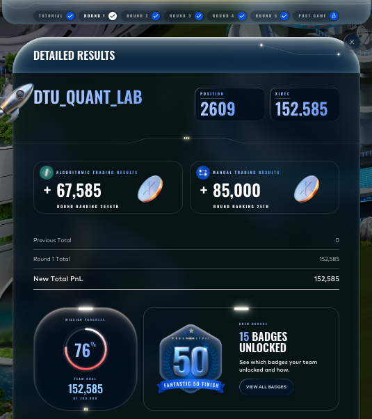

# Round 1 — DTU Quant Lab

| Metric | Value |
|---|---|
| Algorithmic PnL | **+67,585** (rank 3,646 / 12k+) |
| Manual PnL | **+85,000** (rank **25**) |
| Round total | 152,585 |
| Cumulative | 152,585 |
| Global position end of round | 2,609 |

## What was traded

The algorithmic challenge introduced two products with very different microstructure:

- **`ASH_COATED_OSMIUM`** — a pegged product oscillating around a fair value of 10,000 with mean-reverting noise. Variance Ratio statistic VR(100) = 0.03, Hurst exponent 0.39, half-life ≈ 8.4 ticks. The textbook market-making opportunity.
- **`INTARIAN_PEPPER_ROOT`** — a slowly trending product with a deterministic drift of roughly +0.001 per timestamp. Inventory penalty had to be asymmetric (long = trend helps you, short = trend fights you).

The manual round was a two-good bid-volume optimisation: choose `(price, volume)` pairs against an unknown PnL-vs-volume reserve curve. Augusto Villoldo bid 9,000 units of *Dryland Flax* at +30 and 40,000 units of *Ember Mushroom* at +19, hitting the maxima of both sawtooth curves for a **+85,000** PnL and **25th** place worldwide.

See [`algorithmic/`](algorithmic/) and [`manual/`](manual/) for the full write-ups.

## Result screenshot

## What we learned

- A fixed-FV anchor with micro-price refinement beats an Avellaneda–Stoikov reservation price on a strongly pegged product (we tried both; A–S position-skew on OSMIUM cost us 16,593 PnL in backtest before we reverted).
- The honest way to validate any candidate trader is a worst-day-mode rule: the worst single backtest day must be positive. This rule killed about 80% of the ideas surveyed for this round.
