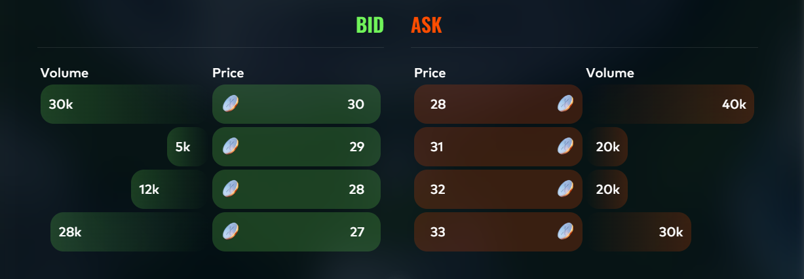
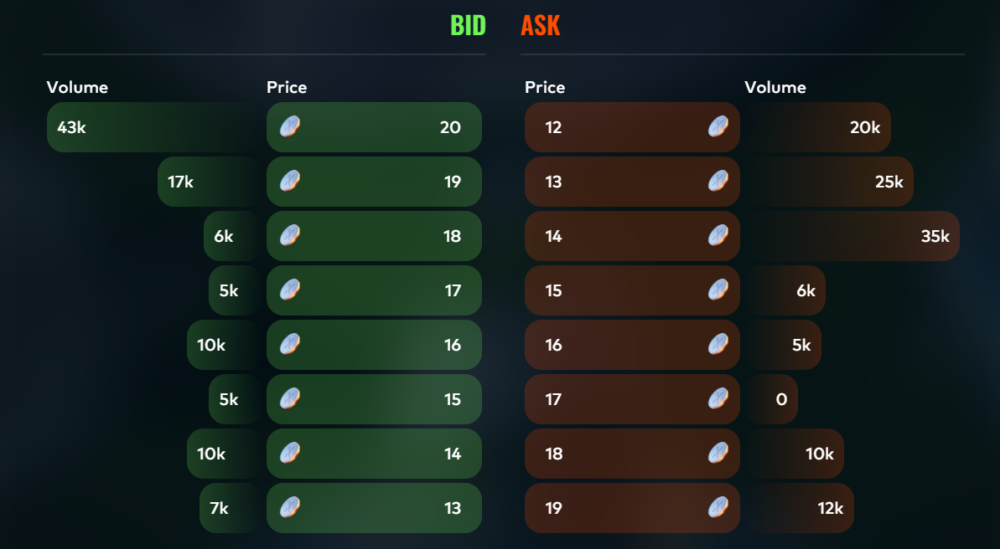
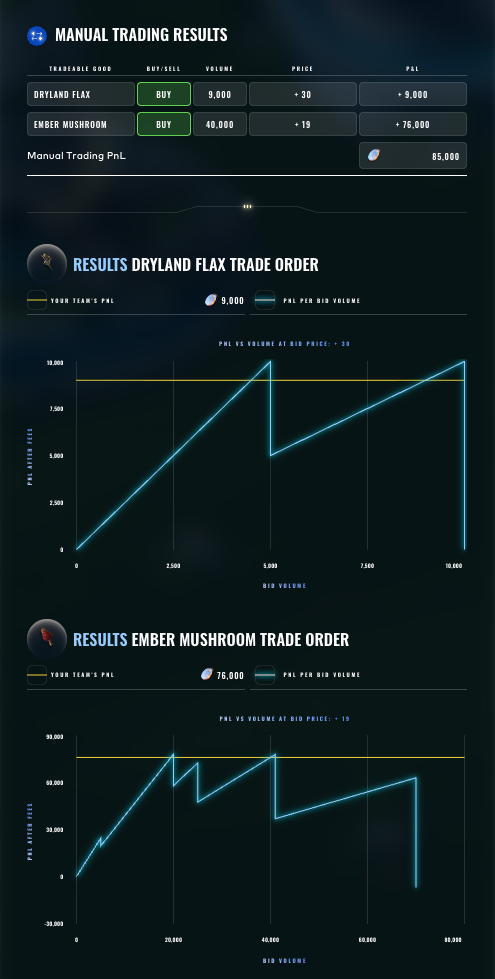

# Round 1 · Manual challenge

| | |
|---|---|
| Final live PnL | **+85,000** XIRECs |
| Rank | **25** worldwide |
| Lead | Augusto Villoldo |

## Challenge

This challenge mirrors a walrasian auction. 
The challenge asks you to find a price and volume of 2 stocks, and proposed bids by others for those two stocks. 
After a bid is submitted, the auction decides a clearance price where a bid is sold if the bid is larger than the clearance price, and an ask is given if the ask is lower than the clearance. 
Additionally, any bid unsold will be sold to the auction house at 30 for Dryland Flax and 20 for Ember Mushroom.
There is a 0.10 fee on each ember mushroom stock.
Dryland Flax:

Ember Mushroom:

## Strategy

This is a simple optimisation problem, where the opposing bids and asks were given to us.
Note that if the volume is small enough, that you can find the clearing price where the amount of bids lower than a value match the volume of asks higher than that value. 
That knowledge allows you to easily find the volume needed at a certain price to force a certain clearance price, and the PnL of each, as you can just bid the differential of total bid lower or equal to the clearance and the ask higher than the clearance, after you subtract one to force that clearance price.  
We decided to use Excel, where we sweeped over all possible clearance prices with their respective volumes for a given guess and chose the one with the highest PnL.

## Our submission

| Good | Side | Price | Volume | Result PnL |
|---|---|---|---|---|
| Dryland Flax | BUY | +30 | 9,000 | +9,000 |
| Ember Mushroom | BUY | +19 | 40,000 | +76,000 |
| **Total** | | | | **+85,000** |

Augusto's choice landed on the apex of both sawtooth functions: the Dryland Flax curve peaks at volume 9,000 and the Ember Mushroom curve peaks at volume 40,000. The +19 bid price for Ember Mushroom was the higher-PnL of the two visible plateaus.

## Result screenshot

## Lessons

- Augusto solved by exhaustively evaluating each integer volume bin against the published feedback graph.
- Volume sizing was the dominant variable; the price premium was a one-tick decision.
