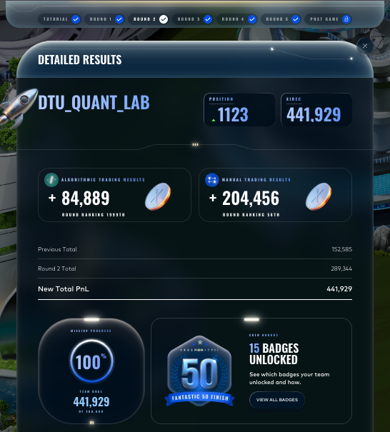

# Round 2 — DTU Quant Lab

| Metric | Value |
|---|---|
| Algorithmic PnL | **+84,889** (rank 1,999) |
| Manual PnL | **+204,456** (rank **58**) |
| Round total | 289,344 |
| Cumulative | **441,929 — qualified for the finals (top 2,000)** |
| Global position end of round | 1,123 |

## What was traded

Round 2 reused the same two algorithmic products as Round 1 — `ASH_COATED_OSMIUM` and `INTARIAN_PEPPER_ROOT` — so the trader file is a direct, lightly tightened evolution of the R1 submission rather than a rewrite. Most of the iteration in this round went into the foreign-language literature surveys (Russian optimal-stopping, Japanese microstructure, French/Dutch LOB calibration) to look for any edge the English literature missed. None survived backtest.

The manual round was a far more complex three-tier portfolio allocation problem.

See [`algorithmic/`](algorithmic/) and [`manual/`](manual/).

## Result screenshot

## What we learned

- Cumulative PnL of **441,929** XIRECs after R2 cleared the qualifier threshold (top 2,000 advance to finals). The portal then **zeroes the cumulative** in R3, which we did not fully internalise at the time — and that fresh-start reset is one reason a single bad finals round (R3) felt much more catastrophic than it really was.
- Surveying Russian, Japanese, French, and Dutch trading literature in parallel was high-effort and produced **zero shipped changes** in this round. The exercise was not wasted — it gave us discipline and a long list of techniques to disqualify — but the time-to-PnL ratio was very low. We adjusted our process accordingly for the finals.
