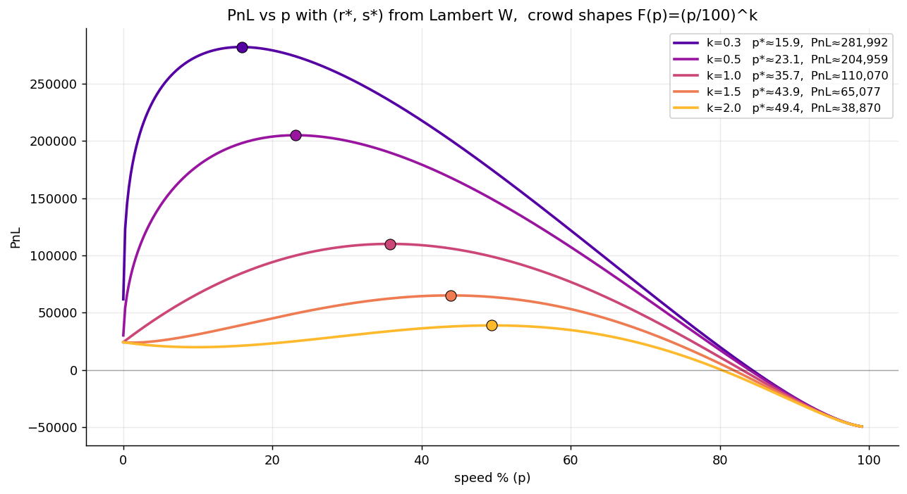

# Round 2 · Manual challenge

| | |
|---|---|
| Final live PnL | **+204,456** XIRECs |
| Rank | **58** worldwide |
| Lead | Augusto Villoldo |

## Challenge

A three-tier portfolio allocation:

> `PnL = research(x) · scale(y) · hit_rate(rank(z)) − budget`

The participant allocated 100% of a budget across three investment tiers:

- **Research** — logarithmic XIREC payoff in invested fraction.
- **Scale** — linear multiplier (×3.2 on invested capital).
- **Speed** — payoff scaled by a hit-rate that depends on the team's competitive rank in the speed pool.

Each tier had its own characteristic curve and the optimum mix depended on the unknown distribution of other teams' speed investments.

## Strategy

Firstly, for a given speed allotment, there is an optimal research and scale distribution. This can be calculated using many different methods, so we won't dive too much into it.
The main decision is the speed allocation. We decided to approach this adverserially and find a realistic, lower bound on PnL irrespective of the actual crowd distribution.

We chose the cmf function $CMF(s) = (s/100)^k$ where k is the crowd shape. If k is low, the distribution is bottom heavy. If k is high, the distribution is top heavy.

As seen in these plots, the potential PnL could be very high for the lower values of K. 
High speed values are basically suicide, as while you can guarantee some profit (except in some cases where everyone else votes higher, but they would also be giving up a lot of income), you lose a lot of potential profit. 
We therefore assumed that K would not be too high.
For lower values of K, we assumed that others will be doing similar analyses. 
They will bid slightly above their optimum, making these strategies very risky since the speed distribution will be crowded for these ranges, causing wild swings in rank for slight differences in speed allocation.
Since we can't be sure of the distribution, we decided to choose a conservative K = 1, and bid a bit above that, making sure we make good profit without being dependent on the exact crowd distribution.

## Our allocation

| Tier | Share of capital | Notes |
|---|---|---|
| Research | 16% | Logarithmic payoff — sized to capture the curve elbow rather than chase its asymptote. |
| Scale | 46% | Linear ×3.2 multiplier — the highest-confidence return tier. |
| Speed | 38% | Calibrated against the publicly visible histogram of teams' speed investments to put us in the high-hit-rate tail without overpaying. |

The portal reported:
- Strategy XIRECs from research = 122,780 (logarithmic).
- Scale multiplier ×3.2 (linear).
- Speed hit rate = 0.64 at rank #1,380.
- Total gross = 254,456, less the 50,000 budget = **+204,456** PnL.

## Result screenshot

## Lessons

- The Speed tier was the highest-variance leg — its payoff depended entirely on where the rest of the field went. The decision rule was to look at the live distribution of teams' speed investments and bid just into the right shoulder.
- A higher Speed allocation could have lifted the hit rate above 0.64 but at material risk of the cliff. We took the conservative line and finished 58th.
