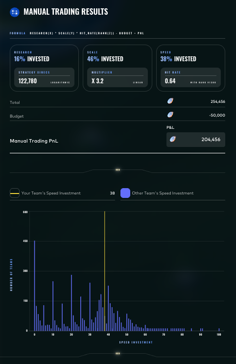

# Round 2 · Manual challenge

| | |
|---|---|
| Final live PnL | **+204,456** XIRECs |
| Rank | **58** worldwide |
| Lead | Augusto Villoldo |

## Challenge

A three-tier portfolio allocation:

> `PnL = research(x) · scale(y) · hit_rate(rank(z)) − budget`

The participant allocated 100% of a budget across three investment tiers:

- **Research** — logarithmic XIREC payoff in invested fraction.
- **Scale** — linear multiplier (×3.2 on invested capital).
- **Speed** — payoff scaled by a hit-rate that depends on the team's competitive rank in the speed pool.

Each tier had its own characteristic curve and the optimum mix depended on the unknown distribution of other teams' speed investments.

## Our allocation

| Tier | Share of capital | Notes |
|---|---|---|
| Research | 16% | Logarithmic payoff — sized to capture the curve elbow rather than chase its asymptote. |
| Scale | 46% | Linear ×3.2 multiplier — the highest-confidence return tier. |
| Speed | 38% | Calibrated against the publicly visible histogram of teams' speed investments to put us in the high-hit-rate tail without overpaying. |

The portal reported:
- Strategy XIRECs from research = 122,780 (logarithmic).
- Scale multiplier ×3.2 (linear).
- Speed hit rate = 0.64 at rank #1,380.
- Total gross = 254,456, less the 50,000 budget = **+204,456** PnL.

## Result screenshot

## Lessons

- The Speed tier was the highest-variance leg — its payoff depended entirely on where the rest of the field went. The decision rule was to look at the live distribution of teams' speed investments and bid just into the right shoulder.
- A higher Speed allocation could have lifted the hit rate above 0.64 but at material risk of the cliff. We took the conservative line and finished 58th.
