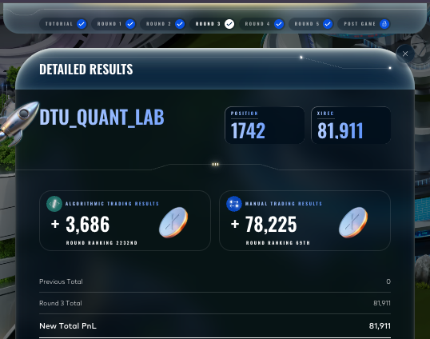
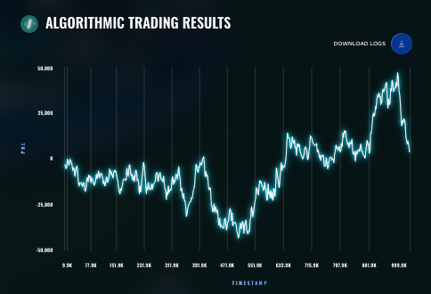
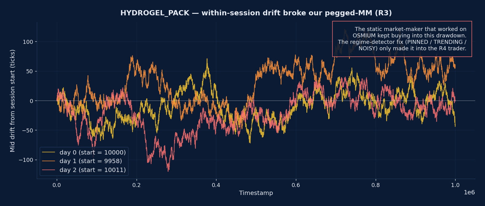
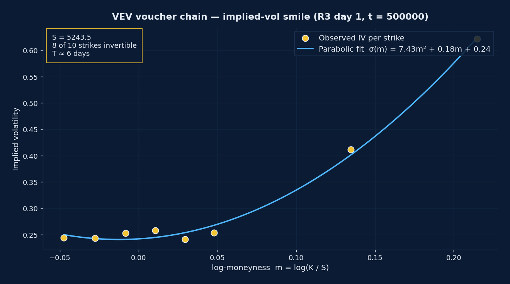

# Round 3 — DTU Quant Lab

| Metric | Value |
|---|---|
| Algorithmic PnL | **+3,686** (rank 2,232) |
| Manual PnL | **+78,225** (rank **69**) |
| Round total | 81,911 |
| Cumulative (finals) | 81,911 |
| Global position end of round | **1,742 — the low point of the campaign** |

This is the round that almost ended our run. The algorithmic leg returned only +3,686, dropping us from #1,123 to #1,742. The finals-only cumulative reset meant we had no R1/R2 cushion to lean on. Augusto's 69th-place finish on the manual challenge, worth +78,225, was the entire reason we survived.

## What was traded

Round 3 introduced **vouchers** — European call options written on a new underlying:

- Legacy from R1/R2: `ASH_COATED_OSMIUM`, `INTARIAN_PEPPER_ROOT`.
- New stationary spot: `HYDROGEL_PACK` (HP), modelled with an OSMIUM-style three-state regime detector (PINNED / TRENDING / NOISY).
- New mean-reverting underlying: `VELVETFRUIT_EXTRACT` (VEV).
- Ten European call vouchers on VEV at strikes `K ∈ {4000, 4500, 5000, 5100, 5200, 5300, 5400, 5500, 6000, 6500}` — to be repriced and quoted with a Black–Scholes core and a smile-aware parabolic IV fit.

A delta-hedge overlay aggregated `D = Σ_K δ_K · pos_K` and offset exposure through `VEV_EXTRACT` spot trades when the aggregate delta breached a threshold.

The manual round was a sealed two-bid auction.

See [`algorithmic/`](algorithmic/) and [`manual/`](manual/).

## Result screenshot

Algorithmic PnL curve from the live submission — the volatility around 0 makes the regime visually obvious:

## What we learned

- A textbook static MM that worked on OSMIUM (pegged) **broke catastrophically** on HP when the mid drifted 70 ticks over a single session — the strategy kept buying into the drawdown. The fix (a 3-state PINNED / TRENDING / NOISY regime detector with a rolling-median anchor and inventory skew that leans **with** the drift) was developed too late for Round 3 and only made it into the R3-into-R4 trader.
- Voucher market-making with a flat IV anchor + parabolic smile correction is the right structure; our R3 IV anchor was set too conservatively and we missed most of the available edge. Round 4 tightened it.
- A bad algorithmic round can still be saved by a disciplined manual operator. Augusto's sealed-bid auction work in R3 turned what would have been an exit into a survival round.

## Analysis on shipped data

  

HYDROGEL_PACK shows session-internal drift of 35+ ticks — a regime our OSMIUM strategy was never designed for. The static MM kept buying into the drawdown for the full session. The 3-state regime detector that fixes this only shipped in Round 4.

  

The VEV chain implies a clear right-skewed smile. Our R3 trader used a flat σ = 0.20 anchor with no parabolic correction — we missed most of the available edge. The parabolic correction is the central R4 voucher upgrade.

## In hindsight

The R3 algorithmic +3,686 is the single most expensive mistake of the campaign. We had the data to detect the HP regime break on the morning the round opened (the rolling-median anchor takes ~20 lines of code), but we were spending iteration budget on voucher theory instead of triage on the new spot product. The lesson — **whenever a new product is added, build the diagnostic before you build the strategy** — is the one that most directly drove the Round 5 cluster-strategy architecture.
