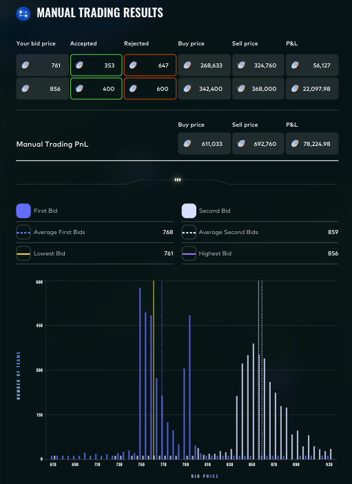

# Round 3 · Manual challenge

| | |
|---|---|
| Final live PnL | **+78,225** XIRECs |
| Rank | **69** worldwide |
| Lead | Augusto Villoldo |

## Challenge

A sealed two-bid auction against an unknown distribution of reserve prices. Each team submits two bids; the engine fills as many units as possible at each bid given the population reserve distribution. The portal histogram suggested a bimodal reserve distribution centred near ~768 and ~859.

## Our submission

| Bid | Price | Accepted | Rejected | Buy spend | Sell revenue | PnL |
|---|---|---|---|---|---|---|
| First | 761 | 353 | 647 | 268,633 | 324,760 | +56,127 |
| Second | 856 | 400 | 600 | 342,400 | 368,000 | +22,098 |
| **Total** | | | | 611,033 | 692,760 | **+78,225** |

The first bid (761) targeted the lower mode of the reserve distribution; the second bid (856) sat just below the upper mode to maximise expected fill volume without overpaying the long right tail.

## Result screenshot

## Lessons

- The first bid alone delivered the majority of the PnL. The structural insight was that the population's average first bid was 768 and the average second bid was 859 — bidding one tick below each mode achieves a strong fill rate without giving up edge.
- This was Augusto's third consecutive top-100 manual finish (25th → 58th → 69th). Without it, the +3,686 algorithmic round would have dropped us out of contention before R5.
