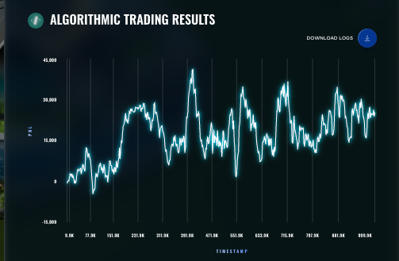

# Round 4 — DTU Quant Lab

| Metric | Value |
|---|---|
| Algorithmic PnL | **+25,351** (rank 1,149) |
| Manual PnL | **+23,566** (rank 699) |
| Round total | 48,917 |
| Cumulative (finals) | 130,828 |
| Global position end of round | 1,372 |

A modest recovery round. The algorithmic leg returned to positive territory after the R3 collapse and the manual gave us a smaller-than-usual contribution. The position climbed from #1,742 to #1,372 — still nowhere near the leaderboard, but stable enough to set up the R5 push.

## What was traded

No new products. The Round 4 algorithmic trader is the Round 3 file with `TTE_DAYS_LIVE` decremented (vouchers have one less day to expiry) and tightened parameters on the voucher edge and HP regime detector. The manual round was an options chain.

See [`algorithmic/`](algorithmic/) and [`manual/`](manual/).

## Result screenshot

Algorithmic PnL curve from the live submission — flat-with-drift, characteristic of a parameter sweep on an already-shaped strategy:

## What we learned

- After spending Round 3 reading literature on PIN (Glosten–Milgrom), VPIN (Easley–López de Prado–O'Hara), Cartea–Jaimungal dynamic spread, Hull–White stochastic volatility, Cont–Kukanov liquidation, and per-counterparty profiling, almost none of it shipped. The R4 edits were a small set of parameter sweeps over the existing R3 trader.
- The honest takeaway is that **paper-driven iteration scales sublinearly** once a strategy has a coherent shape. The remaining edge in the R4 voucher chain was buried in numerical parameters that needed sweeping, not in a new theoretical framework.
- This is the lesson that shaped Round 5: we abandoned single-product theoretical iteration and switched to a cluster-strategy architecture that let multiple shipped variants coexist.
