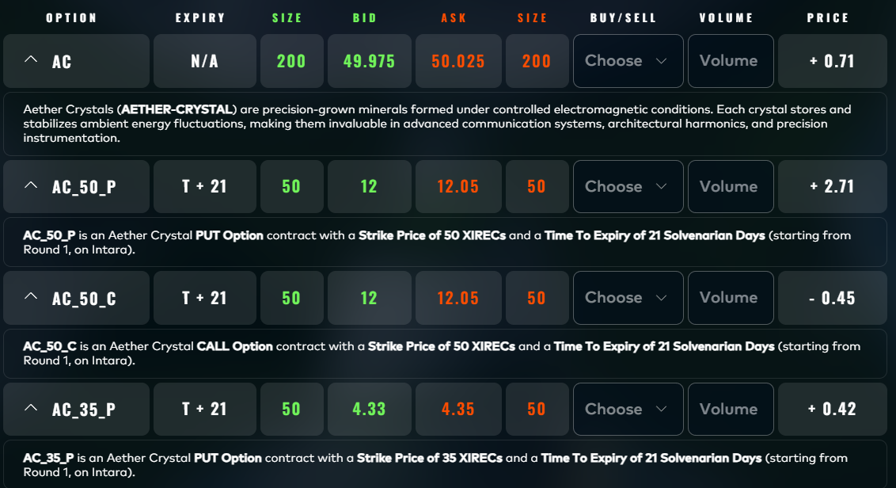
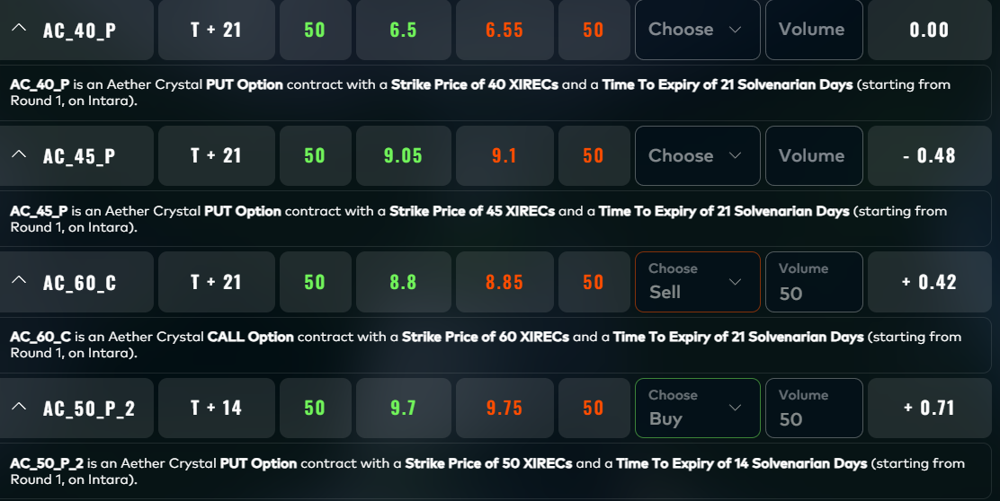
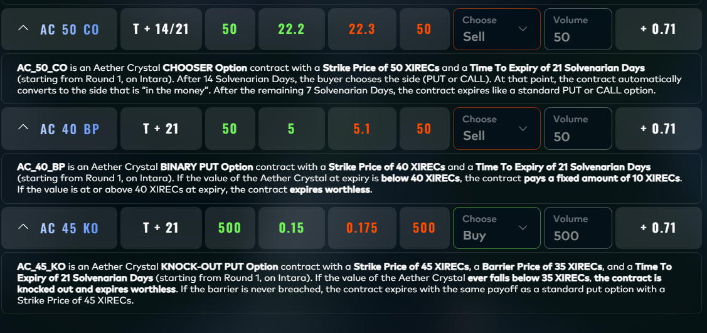

# Round 4 · Manual challenge

| | |
|---|---|
| Fina l live PnL | **+23,566** XIRECs |
| Rank | 699 |
| Lead | Augusto Villoldo |

## Challenge

We are given a fictional underlying `AC`, and both puts and calls, binary and chooser puts, and a forward-style underlier `KO` to either buy, do nothing, or sell.
We are given the volatility of the stock (251%), and the strike / time to expiry.
Note that there are only 5 trading days in a week, hence 252 trading days in a year.

## Strategy

Our strategy involved calculating which options are expected to be in the money and which aren't. 
We then went all in all positive ev options.

We used monte carlo simulation to calculate if the options were expected to make a profit.
Doing it in simulation rather than via analysis mirrors how the competition does the calculations (5 trading days a week with 4 steps a day), and reduces the risk of an incorrect derivation.

## Our submission

| Leg | Side | Volume | Price | PnL |
|---|---|---|---|---|
| `AC_60_C` | SELL | 50 | +414.80 | +20,740 |
| `AC_50_P_2` | BUY | 50 | −282.40 | −14,120 |
| `AC_50_C_2` | BUY | 50 | −468.84 | −23,442 |
| `AC_50_CO` | SELL | 50 | +1,087.08 | +54,354 |
| `AC_40_BP` | SELL | 50 | +300.00 | +15,000 |
| `AC_45_KO` | BUY | 500 | −57.93 | −28,966 |
| **Total** | | | | **+23,566** |

The position was structured around a sell of the in-the-money `AC_60_C` and `AC_50_CO` legs (the "skew receivers") financed by buying the dual `_2` calendar-extended legs and a 10× volume buy of the deep-OTM `AC_45_KO`. The latter ate most of the PnL; in hindsight a smaller `KO` size would have lifted us into the top 200.

## Result screenshot

## Lessons

- Multi-leg options manuals reward the team that *most accurately* models the underlying's terminal distribution. We modelled it as a symmetric, lightly leptokurtic Gaussian. In retrospect, the public distribution had heavier left-tail risk that our `AC_45_KO` long-volume bet did not respect.
- Total ranking gap to the top 100 was less than 15,000 XIRECs — sizing discipline alone on the `KO` leg would have closed it.
