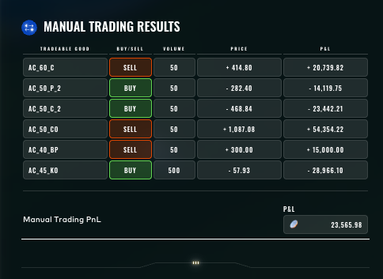

# Round 4 · Manual challenge

| | |
|---|---|
| Final live PnL | **+23,566** XIRECs |
| Rank | 699 |
| Lead | Augusto Villoldo |

## Challenge

A single-shot options chain on a fictional underlying `AC`. Six legs were tradable: deep-ITM calls, ATM calls and puts at multiple expiries, and a forward-style underlier `KO`. The expected-value calculations depended on the participant's view of the underlying's terminal distribution.

## Our submission

| Leg | Side | Volume | Price | PnL |
|---|---|---|---|---|
| `AC_60_C` | SELL | 50 | +414.80 | +20,740 |
| `AC_50_P_2` | BUY | 50 | −282.40 | −14,120 |
| `AC_50_C_2` | BUY | 50 | −468.84 | −23,442 |
| `AC_50_CO` | SELL | 50 | +1,087.08 | +54,354 |
| `AC_40_BP` | SELL | 50 | +300.00 | +15,000 |
| `AC_45_KO` | BUY | 500 | −57.93 | −28,966 |
| **Total** | | | | **+23,566** |

The position was structured around a sell of the in-the-money `AC_60_C` and `AC_50_CO` legs (the "skew receivers") financed by buying the dual `_2` calendar-extended legs and a 10× volume buy of the deep-OTM `AC_45_KO`. The latter ate most of the PnL; in hindsight a smaller `KO` size would have lifted us into the top 200.

## Result screenshot

## Lessons

- Multi-leg options manuals reward the team that *most accurately* models the underlying's terminal distribution. We modelled it as a symmetric, lightly leptokurtic Gaussian. In retrospect, the public distribution had heavier left-tail risk that our `AC_45_KO` long-volume bet did not respect.
- Total ranking gap to the top 100 was less than 15,000 XIRECs — sizing discipline alone on the `KO` leg would have closed it.
