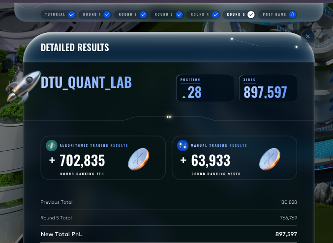
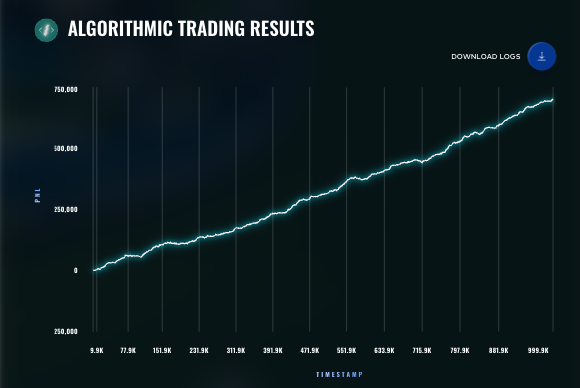

# Round 5 — DTU Quant Lab

| Metric | Value |
|---|---|
| Algorithmic PnL | **+702,835** XIRECs |
| Algorithmic rank | **7 worldwide** |
| Manual PnL | +63,933 (rank 985) |
| Round total | 766,769 |
| Cumulative (finals) | **897,597** |
| Global position end of round | **28** |

The comeback round. After a +3,686 algorithmic Round 3 and a +25,351 Round 4, the Round 5 algorithmic strategy returned **+702,835** — the 7th-best algorithmic score of any team in the world — vaulting us from #1,372 to #28 worldwide.

## What was traded

Round 5 expanded the market to **50 products** organised into **ten product clusters** of five symbols each:

- **PEBBLES** — five differently-sized pebbles (XS, S, M, L, XL). The basket sum is near-deterministic across days at ~50,000 with σ ≈ 2.8, with PEBBLES_XL showing strong negative correlation against the four smaller variants. The keystone alpha of the round.
- **SNACKPACK**, **MICROCHIP**, **OXYGEN_SHAKE**, **PANEL**, **UV_VISOR**, **TRANSLATOR**, **GALAXY_SOUNDS**, **ROBOT**, **SLEEP_POD** — each a five-symbol cluster with cluster-specific structure (cointegration, PCA, pair MR, basket arb, plain inside-spread MM).

Position limit was **10 units per product** across all 50 names.

The manual round was a portfolio of nine themed goods to weight between buy/sell and percentage of capital.

See [`algorithmic/`](algorithmic/) and [`manual/`](manual/).

## Result screenshot

Algorithmic PnL curve from the live submission — the smooth monotonic climb to +702,835 is the OXYGEN_SHAKE_CHOCOLATE carry compounding through the day:

## What we learned

- The cluster-strategy architecture (one abstract `ClusterStrategy` base class and one concrete subclass per cluster, composed by a master `Trader`) let us ship multiple parallel strategies with isolated state — far more iteration throughput per hour than the monolithic R3/R4 file allowed.
- The bulk of the live PnL came from one product: `OXYGEN_SHAKE_CHOCOLATE` at +587,831, captured by a plain inside-spread market-making post on a dislocated live book. Cluster overlays produced small positive contributions on most other clusters; MICROCHIP residual was a net drag.
- Worst-day-mode discipline (the worst single backtest day must be positive) survived to R5 and is the reason this trader was reliable enough to finish 7th rather than 200th. We had a higher-EV variant in development that we did not ship because its worst-day backtest was negative.
- The structural observation we are most proud of is the PEBBLES basket-sum constraint (basket sum ≈ 50,000 with σ ≈ 2.8). It contributed +17,529 — capped by the 10-unit-per-product position limit — but is the cleanest piece of alpha in the round and the lesson we will carry into the next competition.
