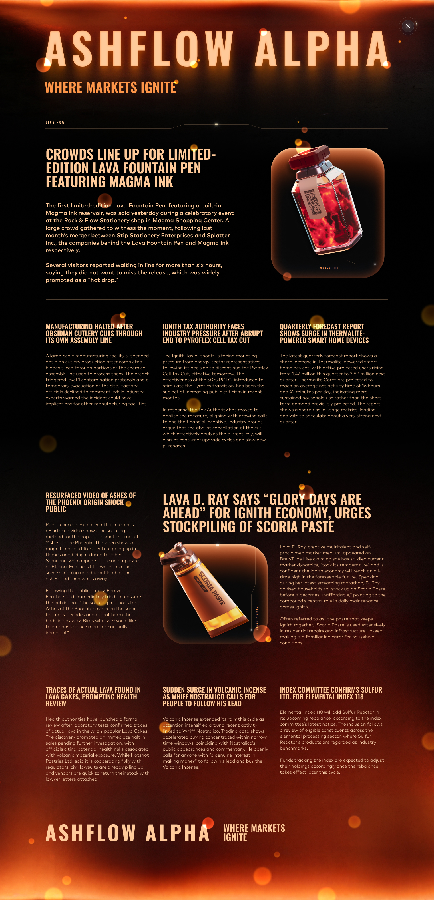

# Round 5 · Manual challenge

| | |
|---|---|
| Final live PnL | **+63,933** XIRECs |
| Rank | 985 |
| Lead | Augusto Villoldo |

## Challenge

We are given 1,000,000 XIRECs, a variety of stocks and a poster providing news stories related to the stocks,
and need to decide a distribution of investment into each option (buy or sell).
Not only are the stocks going to to vary based on their volatilty, but also on the bids of other competitors (if everyone buys a stock, it goes up further). 
Each trade incurred a fee which is $(volume_{specific})^2*budget_{tot}$, regardless of direction.

## Strategy

We decided to play it methodically rather than go all in on the stocks that seemed safe. 
We didn't use the entire budget to keep fees reasonable, since fees go up cubed with total budget (Based on specific volume squared and total budget).
Additionally, we kept strong diversity to limit the fees based on specific volume, and to reduce risk.
We did however invest more in stocks that were more strongly signaled in the informational poster to increase potential profits while maintaining a principled, diversified portfolio.

## Our submission

| Good | Side | % Invested | Investment | Fee | PnL |
|---|---|---|---|---|---|
| Ashes of the Phoenix | SELL | 5% | 50,000 | 2,500 | −748 |
| Pyroflex cells | SELL | 8% | 80,000 | 6,400 | +9,228 |
| Obsidian cutlery | SELL | 4% | 40,000 | 1,600 | −5,566 |
| Magma ink | SELL | 2% | 20,000 | 400 | −845 |
| Thermalite core | BUY | 6% | 60,000 | 3,600 | +9,696 |
| Volcanic incense | SELL | 3% | 30,000 | 900 | +3,471 |
| Scoria paste | SELL | 5% | 50,000 | 2,500 | −3,166 |
| Sulfur reactor | BUY | 9% | 90,000 | 8,100 | +7,582 |
| Lava cake | SELL | 8% | 80,000 | 6,400 | **+44,283** |
| **Total** | | **50%** | 500,000 | 32,400 | **+63,933** |

Lava cake was the single largest winner (+44,283) and the entire reason the manual round closed positive: total winners summed to +74,260, total losers to −10,325, less 32,400 in fees, leaving +63,933.

## Result screenshot

## Lessons

- The fee bites hardest on neutral positions. A handful of low-edge trades (Ashes of the Phoenix, Magma ink, Scoria paste) gave back capital to fees that could have been concentrated into Lava cake or Thermalite core.
- The choice to invest only 50% of capital was correct in expectation but conservative — by the final round we were already locked into a top-30 algorithmic finish and the manual side carried less weight in the total.
