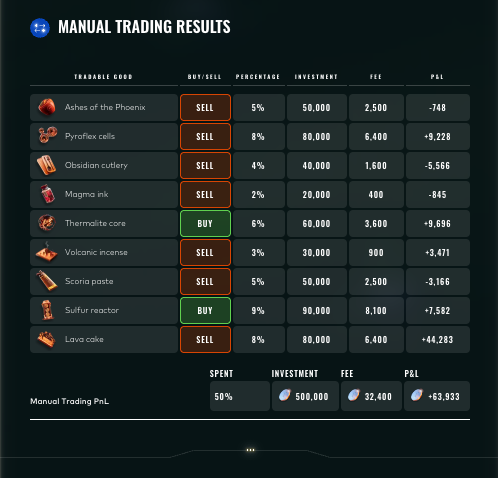

# Round 5 · Manual challenge

| | |
|---|---|
| Final live PnL | **+63,933** XIRECs |
| Rank | 985 |
| Lead | Augusto Villoldo |

## Challenge

Nine themed volcanic and phoenix-related goods to allocate between buy and sell sides, choosing a percentage of capital per leg. Each trade incurred an 8% fee on the invested capital regardless of direction. The portfolio was capped at 100% total allocation (we spent 50%).

## Our submission

| Good | Side | % Invested | Investment | Fee | PnL |
|---|---|---|---|---|---|
| Ashes of the Phoenix | SELL | 5% | 50,000 | 2,500 | −748 |
| Pyroflex cells | SELL | 8% | 80,000 | 6,400 | +9,228 |
| Obsidian cutlery | SELL | 4% | 40,000 | 1,600 | −5,566 |
| Magma ink | SELL | 2% | 20,000 | 400 | −845 |
| Thermalite core | BUY | 6% | 60,000 | 3,600 | +9,696 |
| Volcanic incense | SELL | 3% | 30,000 | 900 | +3,471 |
| Scoria paste | SELL | 5% | 50,000 | 2,500 | −3,166 |
| Sulfur reactor | BUY | 9% | 90,000 | 8,100 | +7,582 |
| Lava cake | SELL | 8% | 80,000 | 6,400 | **+44,283** |
| **Total** | | **50%** | 500,000 | 32,400 | **+63,933** |

Lava cake was the single largest winner (+44,283) and the entire reason the manual round closed positive: total winners summed to +74,260, total losers to −10,325, less 32,400 in fees, leaving +63,933.

## Result screenshot

## Lessons

- The 8% fee bites hardest on neutral positions. A handful of low-edge trades (Ashes of the Phoenix, Magma ink, Scoria paste) gave back capital to fees that could have been concentrated into Lava cake or Thermalite core.
- The choice to invest only 50% of capital was correct in expectation but conservative — by the final round we were already locked into a top-30 algorithmic finish and the manual side carried less weight in the total.
